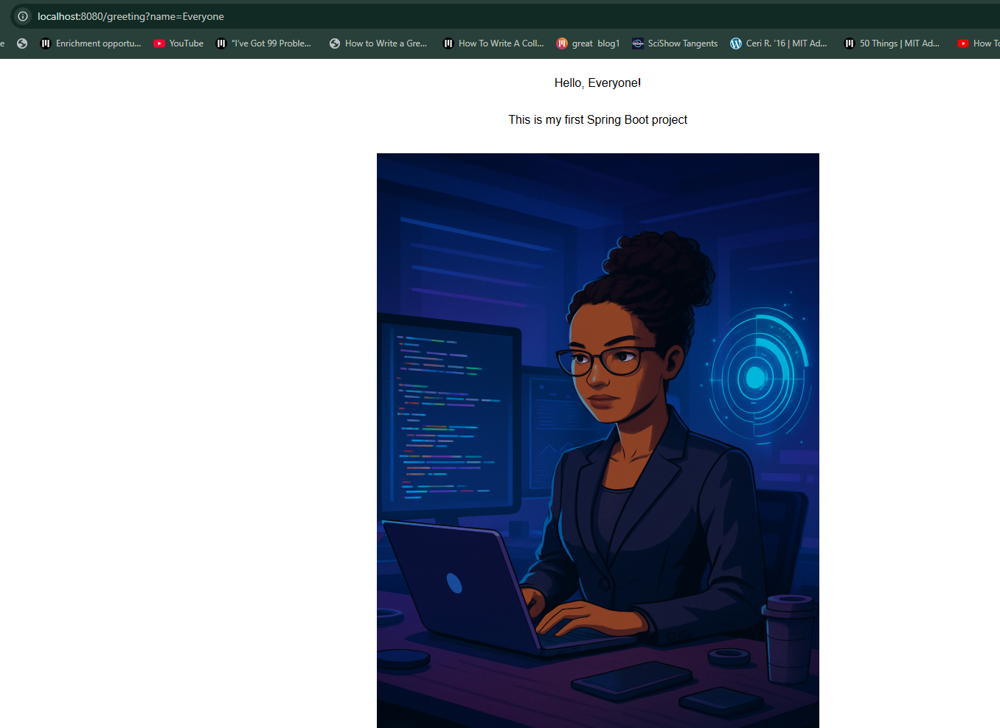

# 🌸 Spring Boot Greeting Web App

This is a simple Spring Boot web application that demonstrates basic usage of **Spring MVC**, **Thymeleaf**, and **HTML** templating to build a minimal dynamic web page.

## 📌 Description

The application displays a personalized greeting message on the landing page. Users can pass their name as a parameter in the URL, and the app will display a customized greeting.

http://localhost:8080/greeting?name=Everyone

## 🚀 Features

- Thymeleaf integration for rendering HTML
- Embedded image rendering in the frontend
- Basic MVC architecture

## 🛠️ Technologies Used

- Java 17+
- Spring Boot
- Spring MVC
- Thymeleaf
- Maven
- HTML5

## 🔧 Getting Started

### Prerequisites

- Java JDK 17+
- Maven

## Preview

